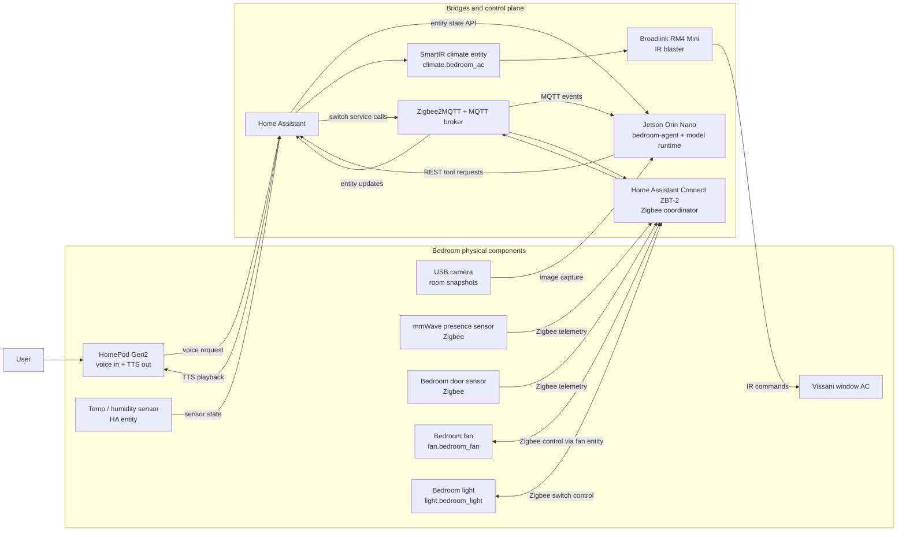
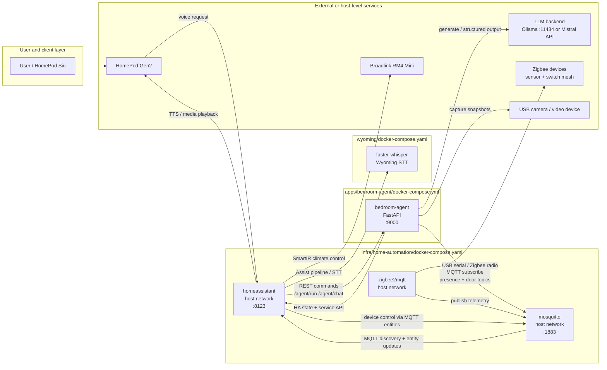
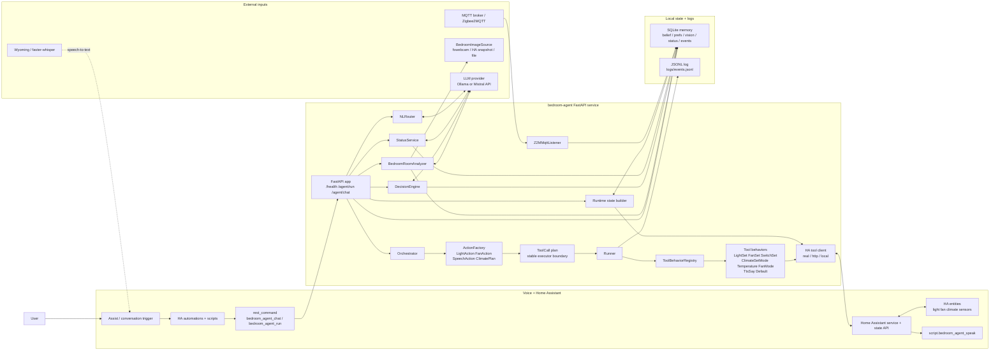
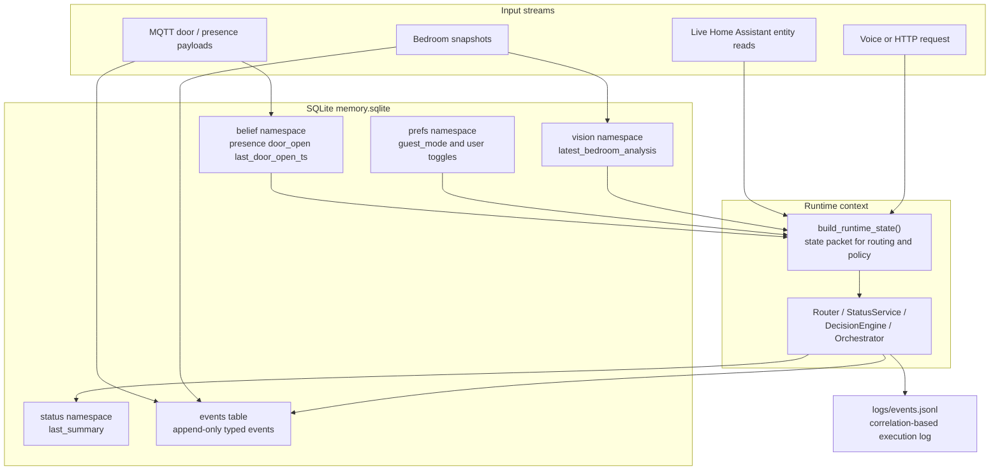
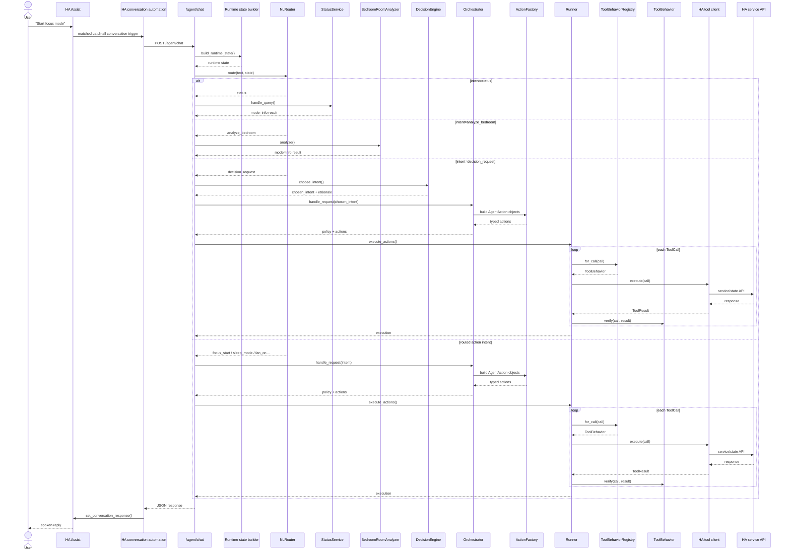
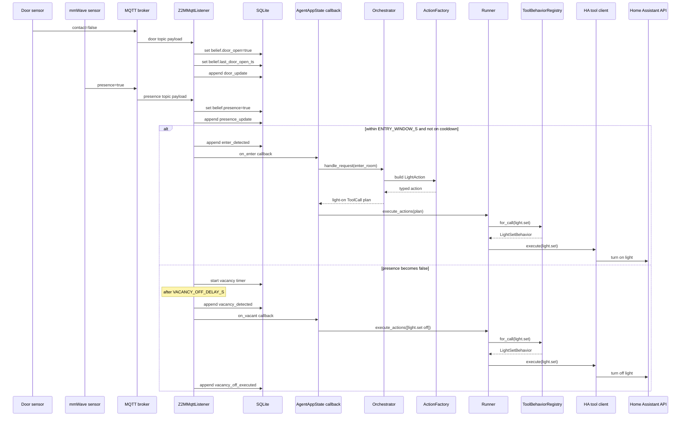

# This is the correct Youtube URL: https://youtu.be/oJxBTXyXbbU.

The one published in the hackeriterate is the wrong link. Please consider my mistake and use this link to watch the demo


# bedroom-agent

Edge-Native Autonomous Intelligence using LLM centric logic that control the entities of the room. 
Totally offline system deployed on Jetson Orin Nano Super

The project is split into three pieces:

- `apps/bedroom-agent`: the FastAPI service that routes requests, evaluates policy, executes tools, listens to MQTT, and stores memory/logs
- `infra/home-automation/ha_config`: Home Assistant configuration that exposes the agent to Assist and scripts
- `wyoming`: speech-to-text container configuration for a local Assist pipeline

## What It Does

- Accepts direct intent requests such as `fan_on`, `sleep_mode`, or `focus_start`
- Accepts natural language requests through `/agent/chat`
- Uses deterministic orchestration for safety-critical actions
- Uses SQLite for beliefs, preferences, recent room analysis, and event memory
- Writes append-only JSONL logs for replay and debugging
- Supports room analysis from a bedroom camera snapshot
- Integrates with Home Assistant for voice, climate, fan, lights, and TTS


## Hardware + ecosystem (locked)

**Compute**

- **NVIDIA Jetson Orin Nano 8GB**

**Sensors + control**

- **Camera** -> to feed photos to the local Ministral model backend
- **mmWave presence sensor** (Zigbee) → presence/occupancy belief state
- **Zigbee smart plug** → bedside lamp + power telemetry use-cases
- **Home Assistant Connect ZBT-2** (Zigbee coordinator, run in **Zigbee mode** for v1.0)
- **Broadlink RM4 Mini (IR blaster)** → controls **Vissani window AC**
- **Home Assistant + SmartIR climate entity** → reliable HVAC abstraction
- **HomePod Gen2** → TTS output + temp/humidity sensor (as available in Home ecosystem)

**Voice control path (locked Option 1)**

- **HomePod Siri → Apple Home Scene → Home Assistant → LLM/Agent → HomePod speaks**

### Sample Camera Photo


This is a representative frame from the bedroom camera used by the vision path. A typical snapshot includes the bed, desk and monitor, chair, closet area, dresser, and mirror, and may also include a person in the room. The agent uses frames like this for `analyze bedroom` requests and for any vision-assisted room-state reasoning.

### Physical Components and Integration Diagram



### Container and Service Interaction Diagram




## Architecture

At runtime the agent looks like this:

1. Home Assistant or a caller sends `POST /agent/run` or `POST /agent/chat`.
2. The app builds a runtime state from Home Assistant entities plus stored beliefs and preferences.
3. `NLRouter` maps text to a high-level intent.
4. `Orchestrator` uses `ActionFactory` to compose typed actions and materializes them into `ToolCall` objects.
5. `Runner` resolves each `ToolCall` through `ToolBehaviorRegistry`, then executes, verifies, cools down, and logs results.
6. MQTT listeners update occupancy and door beliefs continuously in the background.
7. Optional vision analysis captures a bedroom image and asks the configured LLM/VLM for structured output.

### System Architecture Diagram



### Internal Runtime Class Diagram

```mermaid
classDiagram
    class AgentAppState {
        +build_runtime_state(extra_state, intent) dict
        +orchestrator: Orchestrator
        +runner: Runner
    }

    class Orchestrator {
        +handle_request(intent, args, state) dict
        +action_factory: ActionFactory
        -_resolve_light_entity_id(args, state) str
        -_materialize_actions(correlation_id, actions) list~ToolCall~
    }

    class ActionFactory {
        +light(entity_id, state) LightAction
        +fan(entity_id, state) FanAction
        +speech(message) SpeechAction
        +climate(entity_id, hvac_mode, temperature, fan_mode) ClimatePlan
    }

    class AgentAction {
        <<interface>>
        +to_tool_calls(correlation_id) list~ToolCall~
    }

    class LightAction {
        +entity_id: str
        +state: str
        +to_tool_calls(correlation_id) list~ToolCall~
    }

    class FanAction {
        +entity_id: str
        +state: str
        +to_tool_calls(correlation_id) list~ToolCall~
    }

    class SpeechAction {
        +message: str
        +to_tool_calls(correlation_id) list~ToolCall~
    }

    class ClimatePlan {
        +entity_id: str
        +hvac_mode: str
        +temperature: int?
        +fan_mode: str?
        +to_tool_calls(correlation_id) list~ToolCall~
    }

    class ToolCall {
        +tool: str
        +args: dict
        +idempotency_key: str
        +correlation_id: str
        +timeout_s: float?
    }

    class Runner {
        +execute_actions(correlation_id, actions, cooldown_key, cooldown_seconds, deadline) dict
        +read_entity_state(entity_id) dict
        +behavior_registry: ToolBehaviorRegistry
    }

    class ToolBehaviorRegistry {
        +for_call(call) ToolBehavior
    }

    class ToolBehavior {
        <<interface>>
        +is_retryable(call) bool
        +verify(runner, call, result) dict
        +is_verification_critical(call) bool
    }

    class BaseToolBehavior
    class LightSetBehavior
    class FanSetBehavior
    class SwitchSetBehavior
    class ClimateSetModeBehavior
    class ClimateSetTemperatureBehavior
    class ClimateSetFanModeBehavior
    class TtsSayBehavior
    class DefaultToolBehavior

    class ToolExecutor {
        +execute(call) ToolResult
        +get_state() dict
    }

    class HAToolClientHTTP {
        +execute(call) ToolResult
    }

    class HAToolClientReal {
        +execute(call) ToolResult
        +read_entity_state(entity_id) dict
    }

    class ToolResult {
        +ok: bool
        +tool: str
        +details: dict
    }

    AgentAppState --> Orchestrator
    AgentAppState --> Runner

    Orchestrator --> ActionFactory
    ActionFactory --> AgentAction
    LightAction ..|> AgentAction
    FanAction ..|> AgentAction
    SpeechAction ..|> AgentAction
    ClimatePlan ..|> AgentAction

    AgentAction --> ToolCall

    Runner --> ToolBehaviorRegistry
    ToolBehaviorRegistry --> ToolBehavior
    BaseToolBehavior ..|> ToolBehavior
    LightSetBehavior --|> BaseToolBehavior
    FanSetBehavior --|> BaseToolBehavior
    SwitchSetBehavior --|> BaseToolBehavior
    ClimateSetModeBehavior --|> BaseToolBehavior
    ClimateSetTemperatureBehavior --|> BaseToolBehavior
    ClimateSetFanModeBehavior --|> BaseToolBehavior
    TtsSayBehavior --|> BaseToolBehavior
    DefaultToolBehavior --|> BaseToolBehavior

    Runner --> ToolCall
    Runner --> ToolResult
    Runner --> ToolExecutor
    Runner --> HAToolClientHTTP
    Runner --> HAToolClientReal
```



### Data Architecture Diagram



### Voice Chat Flow Diagram



### MQTT Entry Flow Diagram



Mermaid source files also live in `docs/`:

- `docs/architecture.mmd`
- `docs/agent_runtime_class.mmd`
- `docs/container_services.mmd`
- `docs/physical_integration.mmd`
- `docs/voice_chat_flow.mmd`
- `docs/mqtt_entry_flow.mmd`
- `docs/data_architecture.mmd`
- `docs/analyze_bedroom.mmd`
- `docs/diagrams.md`

## Quick Start

### Local Python

```bash
cd apps/bedroom-agent
python -m venv .venv
source .venv/bin/activate
pip install -U pip
pip install -e ".[dev]"
uvicorn src.app:app --host 0.0.0.0 --port 9000 --reload
```

### Docker

```bash
cd apps/bedroom-agent
docker compose up --build
```

The service listens on `http://localhost:9000`.

## Core Configuration

The agent reads settings from `apps/bedroom-agent/.env`. The most important variables are:

- `AGENT_MODE`: `shadow` or `active`
- `TOOL_BACKEND`: `local`, `http`, or `ha`
- `HA_BASE_URL` and `HA_TOKEN`: Home Assistant API access
- `LLM_BASE_URL` and `LLM_MODEL`: local model backend settings
- `OPENAI_API_KEY`: optional for local OpenAI-compatible servers
- `MQTT_HOST`, `MQTT_PORT`, `Z2M_DOOR_TOPIC`, `Z2M_PRESENCE_TOPIC`: Zigbee2MQTT integration
- `CAMERA_MODE`, `CAMERA_DEVICE`, `VISION_FALLBACK_IMAGE_PATH`: image capture configuration

For a full list, see `apps/bedroom-agent/src/core/config.py`.

## Home Assistant Integration

Home Assistant configuration lives under `infra/home-automation/ha_config`.

- `configuration.yaml` defines `rest_command` calls into the agent
- `automations.yaml` routes every Assist utterance to `/agent/chat`
- `scripts.yaml` exposes helper scripts such as `agent_chat_request` and `bedroom_agent_speak`

The current voice entrypoint is a catch-all Assist trigger, so prompts like these all go through the agent LLM:

- `start focus mode`
- `cool the room`
- `analyze bedroom`
- `check my bedroom`

This will also shadow normal built-in Assist intent handling unless you narrow the trigger again.

If you change `configuration.yaml`, restart Home Assistant. If you only change automations or scripts, a reload is usually enough.

## Repository Layout

```text
apps/bedroom-agent/             FastAPI agent service, Dockerfile, tests
infra/home-automation/ha_config Home Assistant YAML config
wyoming/                        faster-whisper compose file
docs/                           diagrams, contracts, runbook
```

## Documentation

- `apps/bedroom-agent/README.md`: app-specific setup and API usage
- `docs/contracts.md`: request/response, tool, state, and event contracts
- `docs/runbook.md`: deployment, operations, and troubleshooting

## Current Scope

This repo is still a pragmatic v0:

- orchestration is deterministic even when routing uses an LLM
- safety checks are local and explicit
- voice support is implemented through Home Assistant conversation automations
- room analysis is useful, but depends heavily on the configured model actually supporting image inputs well
