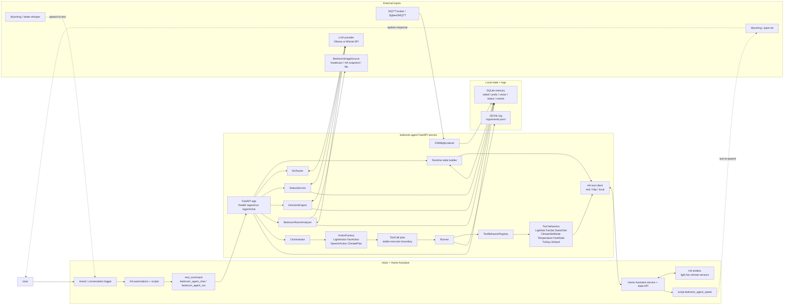
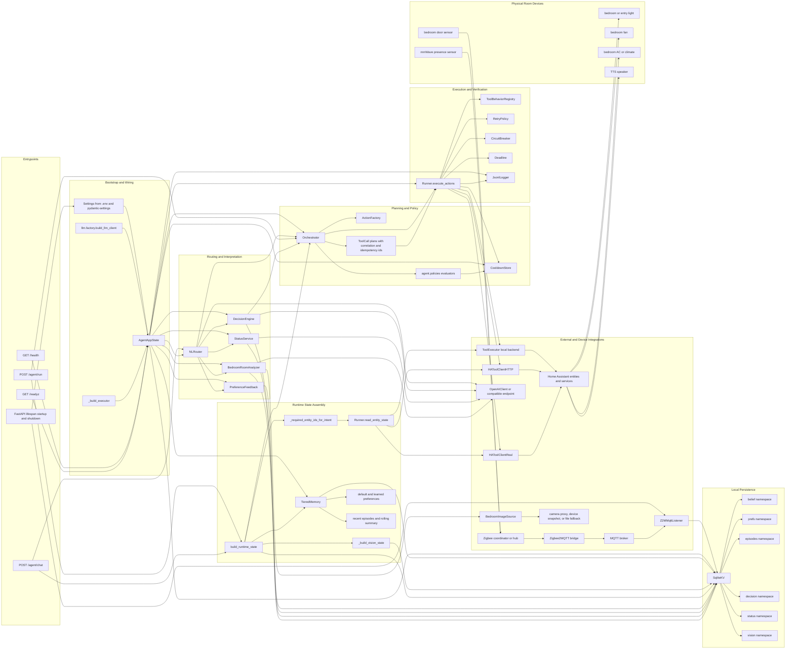
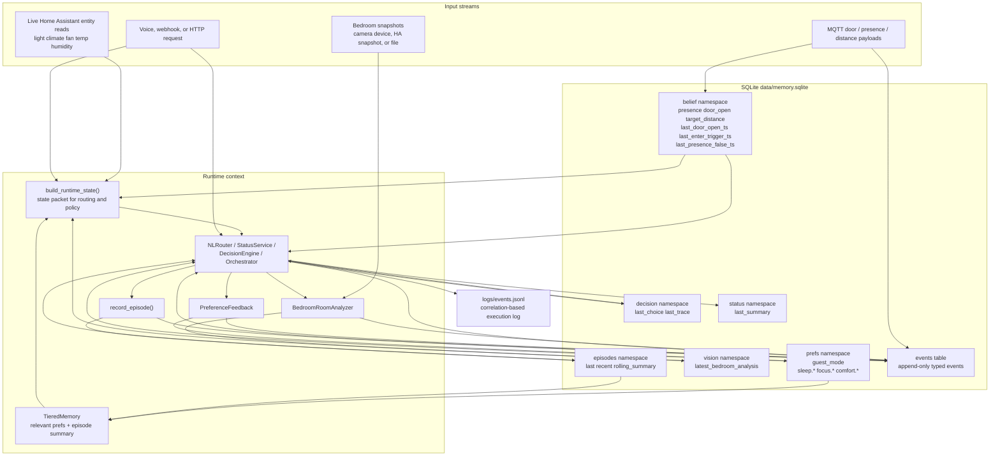
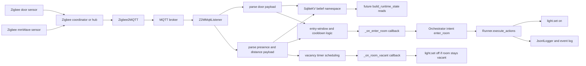
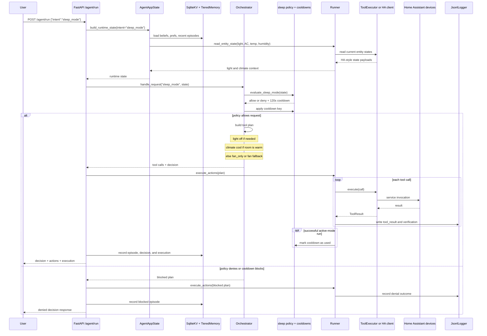
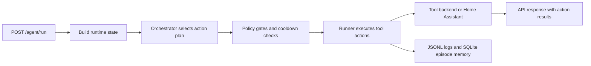
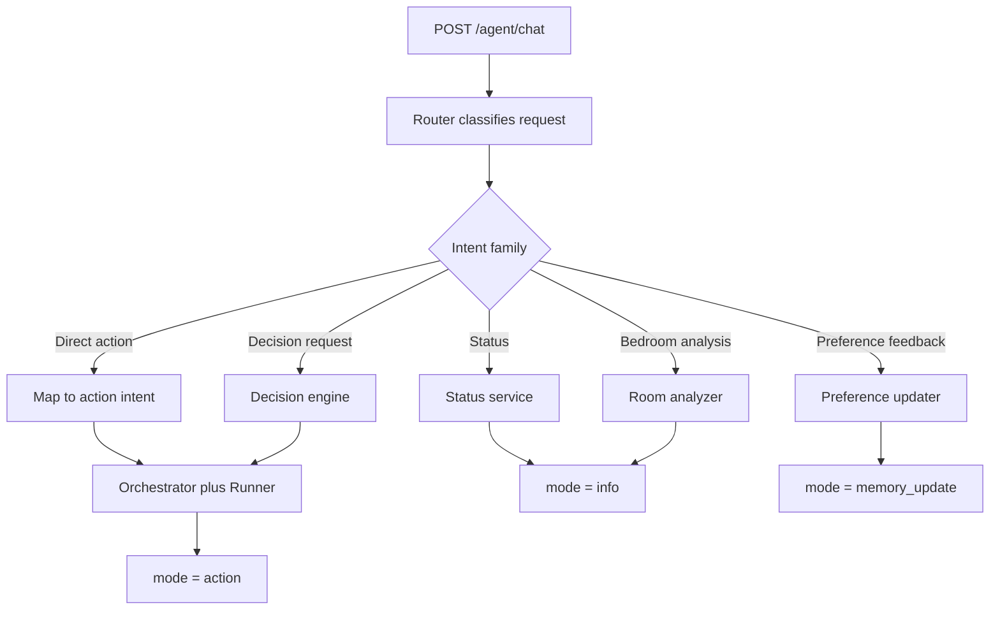
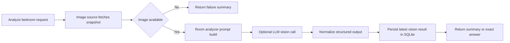

# EdgeAgent (aka bedroom-agent)

EdgeAgent (aka bedroom-agent) is a local-first embodied AI system for personalized room intelligence—combining multimodal perception, memory, and policy-gated action to safely control a real environment on edge hardware.
Deployed on Jetson nano super.

**Totally offline system deployed on [Jetson Orin Nano Super](https://www.nvidia.com/en-us/autonomous-machines/embedded-systems/jetson-orin/nano-super-developer-kit/)**

The project is split into four pieces:

- `apps/bedroom-agent`: the FastAPI service that routes requests, evaluates policy, executes tools, listens to MQTT, and stores memory/logs

- `infra/home-automation/ha_config`: Home Assistant configuration that exposes the agent to Assist and scripts

- `wyoming`: speech-to-text using fast-whisper. Text to speech using piper.

- `Ministral 3B Instruct`: Quantized LLM running using llama.cpp (CUDA optimized)


**LLM Stack**

- This project uses [Ministral 3B Instruct (2512)](https://docs.mistral.ai/models/ministral-3-3b-25-12) as the core LLM.

- Because the system runs on a Jetson Orin Nano Super with 8GB memory, the model is deployed in a [4-bit quantized GGUF](https://huggingface.co/mistralai/Ministral-3-3B-Instruct-2512-GGUF) format to fit within edge-device resource limits.

- The model is served locally using llama.cpp as a system service, with CUDA acceleration enabled on the Jetson for faster inference.

- To stay within the device’s memory and latency constraints, the model runs with a reduced context window of 2048 tokens and uses GPU layer offloading (`-ngl`) so computation is shared across the CPU and GPU.

**Optimization Notes**
- TensorRT-based optimization was explored to further improve performance and quantization efficiency.

- However, because this project uses a multimodal vision + text workflow, TensorRT would require handling the vision and language components separately.

- On an 8GB edge device, that split pipeline introduced too much complexity and was not practical for the current system design.

- For that reason, llama.cpp with CUDA offloading was chosen as the most feasible and reliable deployment path for this version of the project.


**Services running for the project**
- Bedroom-agent microservice (Brain of the project)
- [ministral-3b-2512](https://docs.mistral.ai/models/ministral-3-3b-25-12) LLM model
- Zigbee2MQTT
- Mosquitto (Message queue)
- Home assistant
- Wyoming (For speech to text)
- Piper (For text to speech)


**Hardware + ecosystem**

**Compute**

- **NVIDIA Jetson Orin Nano 8GB**

**Sensors + control**

- **Camera** -> to feed photos to the local Ministral model backend
- **mmWave presence sensor** (Zigbee) → presence/occupancy belief state
- **Zigbee smart plug** → bedside lamp + power telemetry use-cases
- **Home Assistant Connect ZBT-2** (Zigbee coordinator, run in **Zigbee mode** for v1.0)
- **Broadlink RM4 Mini (IR blaster)** → controls **Vissani window AC**
- **Home Assistant + SmartIR climate entity** → reliable HVAC abstraction
- **HomePod Gen2** → TTS output + temp/humidity sensor (as available in Home ecosystem)
- **Door Sensor** → For tracking door in and out events and also used for presence tracking
- **Temperature and Humidity Sensor** → Monitors the temperature and humidity of the room. Adjusting comfort mode based on temperature and humidity.
- **Switch bot** → Switch bot to control dome light in the room. Making a dumb light into a smart one.

**Voice control path (locked Option 1)**

- **HomePod Siri → Apple Home Scene → Home Assistant → LLM/Agent → HomePod speaks**
- **Homeassistant assist** → Works with voice assist with Tony open wake word (Using apple shortcuts). Relays commands to `/agent/chat` making it a seamless experience.

## Visual Overview

### Architecture Diagram

High-level system map:



Door/presence Zigbee sensor flow is broken out separately in the sensor diagram below.

Very detailed app component view:



### Data Architecture



### Sample Bedroom Image

Tracked sample snapshot used for local bedroom-analysis development:


## Repository Layout

- `apps/bedroom-agent`: main FastAPI service, agent logic, memory, tests, Docker config
- `infra/home-automation`: Home Assistant and related deployment assets
- `mock_ha`: lightweight mock Home Assistant service for local integration work
- `wyoming`: local speech-to-text container config
- `evals`: evaluation scenarios and harnesses

## Current Behavior

- Direct action endpoint: `POST /agent/run`
- Natural-language endpoint: `POST /agent/chat`
- Readiness and liveness: `GET /health`, `GET /readyz`
- Deterministic orchestration for `fan_on`, `fan_off`, `enter_room`, `sleep_mode`, `focus_start`, `focus_end`, `comfort_adjust`, and `no_action`
- Natural-language routing for `status`, `analyze_bedroom`, and `decision_request`
- SQLite-backed beliefs, preferences, decision traces, recent episodes, and cached vision analysis
- Sleep preference feedback from follow-up chat such as "too cold" or "warmer next time"
- Optional bedroom snapshot analysis using a local or remote OpenAI-compatible model endpoint

## Flow Diagrams

### Sensor and Occupancy Flow



### Sleep Mode Sequence



### Direct Intent Execution



### Natural-Language Routing



### Bedroom Vision Analysis



## Quick Start

Install the service:

```bash
cd apps/bedroom-agent
python -m venv .venv
source .venv/bin/activate
pip install -U pip
pip install -e ".[dev]"
```

Run the agent in fully local mode:

```bash
TOOL_BACKEND=local \
VISION_ANALYSIS_ENABLED=false \
uvicorn src.app:app --host 0.0.0.0 --port 9000 --reload
```

Optional: run the mock Home Assistant service from the repo root:

```bash
python -m uvicorn mock_ha.app:app --host 0.0.0.0 --port 8124 --reload
```

Then point the agent at it:

```bash
cd apps/bedroom-agent
TOOL_BACKEND=http \
HA_BASE_URL=http://127.0.0.1:8124 \
VISION_ANALYSIS_ENABLED=false \
uvicorn src.app:app --host 0.0.0.0 --port 9000 --reload
```

## API At A Glance

Health check:

```bash
curl http://127.0.0.1:9000/health
curl http://127.0.0.1:9000/readyz
```

Direct intent:

```bash
curl -X POST http://127.0.0.1:9000/agent/run \
  -H 'Content-Type: application/json' \
  -d '{
    "intent": "sleep_mode",
    "args": {},
    "state": {"guest_mode": false}
  }'
```

Natural-language request:

```bash
curl -X POST http://127.0.0.1:9000/agent/chat \
  -H 'Content-Type: application/json' \
  -d '{
    "text": "What should happen now?",
    "state": {"guest_mode": false}
  }'
```

`/agent/chat` can return:

- `mode="action"` for routed or decision-driven actions
- `mode="info"` for status or bedroom analysis queries
- `mode="memory_update"` when follow-up feedback updates stored preferences

## Configuration

The authoritative settings live in [apps/bedroom-agent/src/core/config.py](/home/rosurya/bedroom-agent/apps/bedroom-agent/src/core/config.py).

Common variables:

- `AGENT_MODE=shadow|active`
- `TOOL_BACKEND=local|http|ha`
- `HA_BASE_URL`, `HA_TOKEN`
- `LLM_BASE_URL`, `LLM_MODEL`, `OPENAI_API_KEY`
- `LLM_DECISION_ENABLED`, `LLM_DECISION_TIMEOUT_S`, `LLM_DECISION_MIN_CONFIDENCE`
- `MQTT_HOST`, `MQTT_PORT`, `Z2M_DOOR_TOPIC`, `Z2M_PRESENCE_TOPIC`
  `Z2M_DOOR_TOPIC` can be a comma-separated list when multiple door sensors should share the same entry logic.
- `SQLITE_PATH`
- `CAMERA_MODE=device|ha_snapshot|file`
- `VISION_ANALYSIS_ENABLED`, `VISION_FALLBACK_IMAGE_PATH`

## Verification

From `apps/bedroom-agent`:

```bash
./.venv/bin/ruff check src tests
./.venv/bin/pytest tests -q
```

## More Detail

Service-specific docs are in [apps/bedroom-agent/README.md](/apps/bedroom-agent/README.md).
