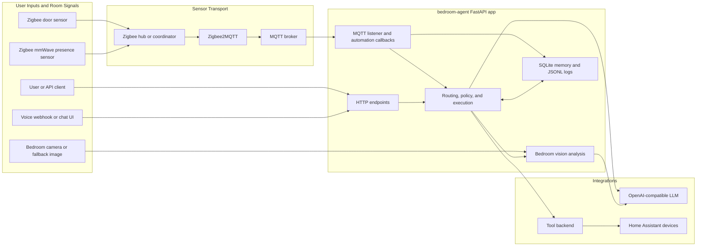
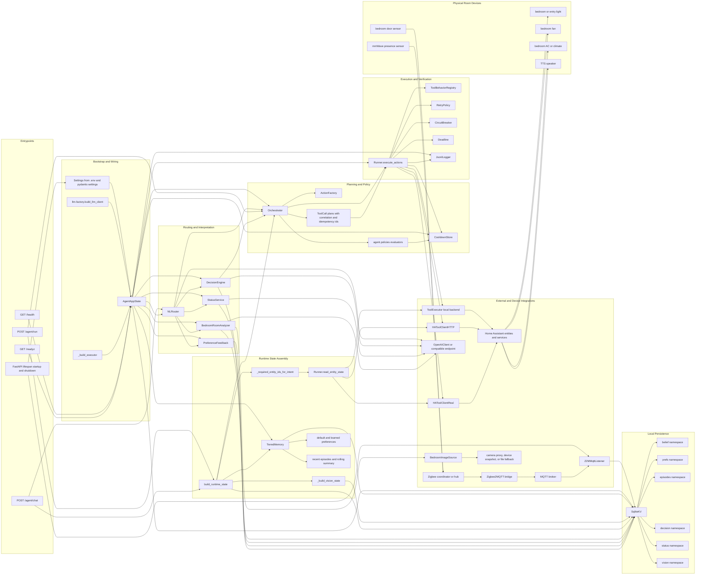
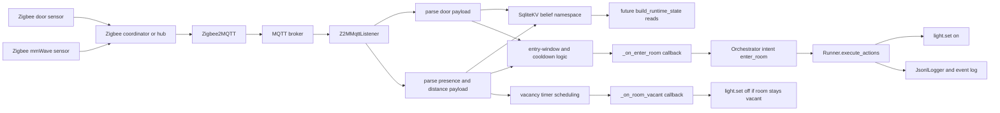
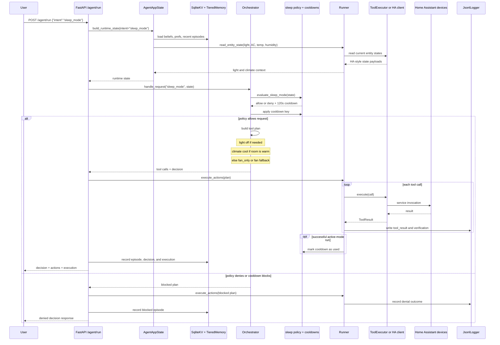
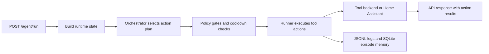
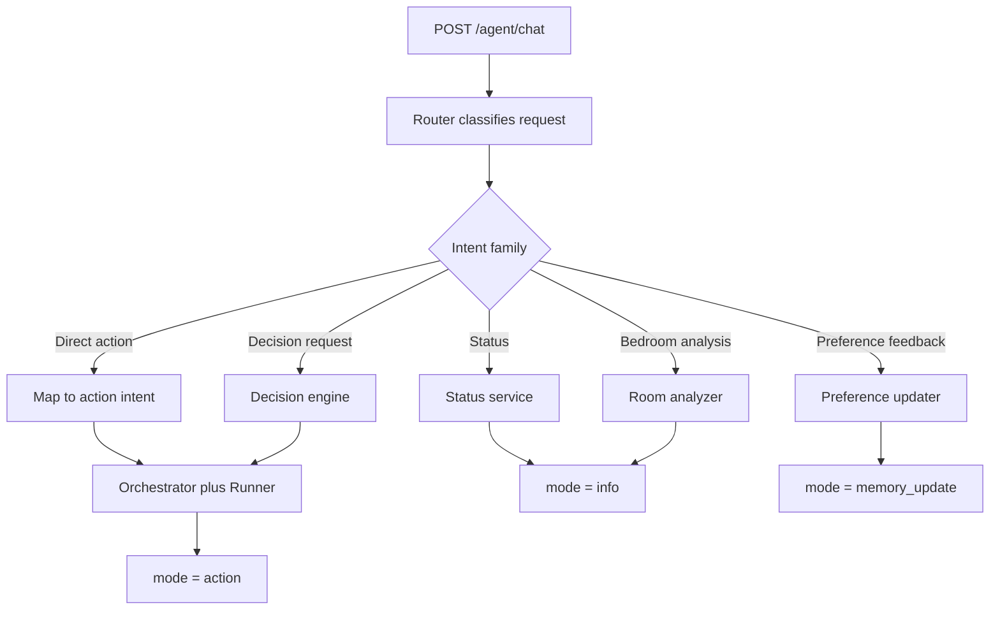
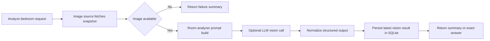

# bedroom-agent

Local-first bedroom automation stack centered on a FastAPI agent. The agent keeps tool execution deterministic, uses lightweight SQLite memory, listens to MQTT occupancy signals, and can optionally call an OpenAI-compatible LLM for routing, explanation, decision support, and bedroom image analysis.

## Visual Overview

### Architecture Diagram

High-level system map:



Very detailed app component view:



### Sample Bedroom Image

Tracked sample snapshot used for local bedroom-analysis development:


## Repository Layout

- `apps/bedroom-agent`: main FastAPI service, agent logic, memory, tests, Docker config
- `infra/home-automation`: Home Assistant and related deployment assets
- `mock_ha`: lightweight mock Home Assistant service for local integration work
- `wyoming`: local speech-to-text container config
- `evals`: evaluation scenarios and harnesses

## Current Behavior

- Direct action endpoint: `POST /agent/run`
- Natural-language endpoint: `POST /agent/chat`
- Readiness and liveness: `GET /health`, `GET /readyz`
- Deterministic orchestration for `fan_on`, `fan_off`, `enter_room`, `sleep_mode`, `focus_start`, `focus_end`, `comfort_adjust`, and `no_action`
- Natural-language routing for `status`, `analyze_bedroom`, and `decision_request`
- SQLite-backed beliefs, preferences, decision traces, recent episodes, and cached vision analysis
- Sleep preference feedback from follow-up chat such as "too cold" or "warmer next time"
- Optional bedroom snapshot analysis using a local or remote OpenAI-compatible model endpoint

## Flow Diagrams

### Sensor and Occupancy Flow



### Sleep Mode Sequence



### Direct Intent Execution



### Natural-Language Routing



### Bedroom Vision Analysis



## Quick Start

Install the service:

```bash
cd apps/bedroom-agent
python -m venv .venv
source .venv/bin/activate
pip install -U pip
pip install -e ".[dev]"
```

Run the agent in fully local mode:

```bash
TOOL_BACKEND=local \
VISION_ANALYSIS_ENABLED=false \
uvicorn src.app:app --host 0.0.0.0 --port 9000 --reload
```

Optional: run the mock Home Assistant service from the repo root:

```bash
python -m uvicorn mock_ha.app:app --host 0.0.0.0 --port 8124 --reload
```

Then point the agent at it:

```bash
cd apps/bedroom-agent
TOOL_BACKEND=http \
HA_BASE_URL=http://127.0.0.1:8124 \
VISION_ANALYSIS_ENABLED=false \
uvicorn src.app:app --host 0.0.0.0 --port 9000 --reload
```

## API At A Glance

Health check:

```bash
curl http://127.0.0.1:9000/health
curl http://127.0.0.1:9000/readyz
```

Direct intent:

```bash
curl -X POST http://127.0.0.1:9000/agent/run \
  -H 'Content-Type: application/json' \
  -d '{
    "intent": "sleep_mode",
    "args": {},
    "state": {"guest_mode": false}
  }'
```

Natural-language request:

```bash
curl -X POST http://127.0.0.1:9000/agent/chat \
  -H 'Content-Type: application/json' \
  -d '{
    "text": "What should happen now?",
    "state": {"guest_mode": false}
  }'
```

`/agent/chat` can return:

- `mode="action"` for routed or decision-driven actions
- `mode="info"` for status or bedroom analysis queries
- `mode="memory_update"` when follow-up feedback updates stored preferences

## Configuration

The authoritative settings live in [apps/bedroom-agent/src/core/config.py](/home/rosurya/bedroom-agent/apps/bedroom-agent/src/core/config.py).

Common variables:

- `AGENT_MODE=shadow|active`
- `TOOL_BACKEND=local|http|ha`
- `HA_BASE_URL`, `HA_TOKEN`
- `LLM_BASE_URL`, `LLM_MODEL`, `OPENAI_API_KEY`
- `LLM_DECISION_ENABLED`, `LLM_DECISION_TIMEOUT_S`, `LLM_DECISION_MIN_CONFIDENCE`
- `MQTT_HOST`, `MQTT_PORT`, `Z2M_DOOR_TOPIC`, `Z2M_PRESENCE_TOPIC`
- `SQLITE_PATH`
- `CAMERA_MODE=device|ha_snapshot|file`
- `VISION_ANALYSIS_ENABLED`, `VISION_FALLBACK_IMAGE_PATH`

## Verification

From `apps/bedroom-agent`:

```bash
./.venv/bin/ruff check src tests
./.venv/bin/pytest tests -q
```

## More Detail

Service-specific docs are in [apps/bedroom-agent/README.md](/home/rosurya/bedroom-agent/apps/bedroom-agent/README.md).
